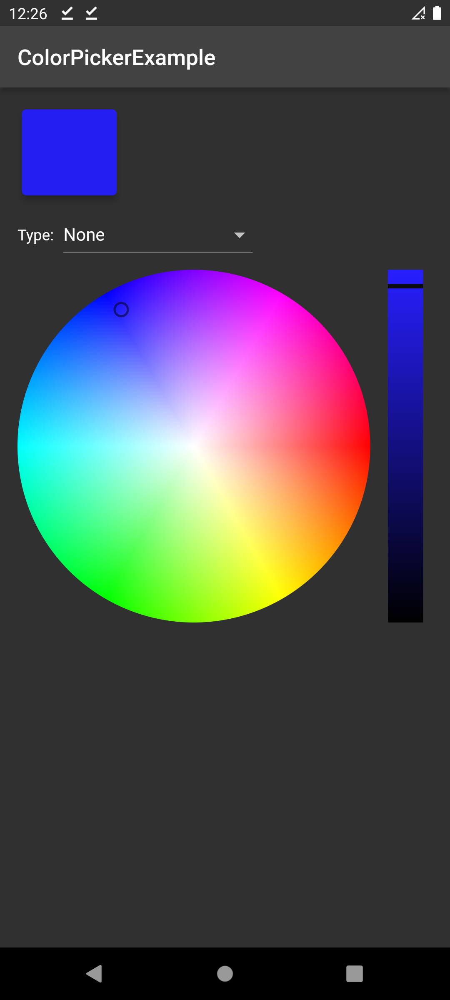
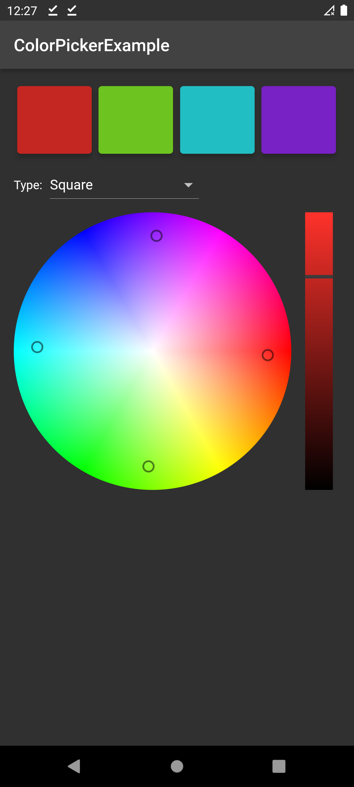

# Color Picker and Harmonizer Library for Android


Color Picker and Harmonizer Library for Flutter. Pick the color from wheel. Choose harmony type and get list of colors.

# Features:

* Color Picker View
* 11 types of harmony
* Color Selected callback
* Can be untouchable

# Preview


|               Color Picker Mode               |                 Color Harmonizer Mode                 |  
|:---------------------------------------------:|:-----------------------------------------------------:|
|  |  |

# Usage

1. Import

```dart
import  'package:colorpicker/colorpicker.dart';
```

2. Basic usage

```dart
ColorPicker(
	hsvColor: const  HSVColor.fromAHSV(1, 0, 0, 1),
	harmonyType: HarmonyTypes.complementary,
	isTouchable: true,
	colorChanged: (list) {});
	},
),
```

# Example

```dart
import 'package:colorpicker/colorpicker.dart';
import 'package:flutter/material.dart';

void main() {
  runApp(const MyApp());
}

class MyApp extends StatelessWidget {
  const MyApp({super.key});

  @override
  Widget build(BuildContext context) {
    return MaterialApp(
      title: 'ColorPickerExample',
      theme: ThemeData.dark(),
      debugShowCheckedModeBanner: false,
      home: const MyHomePage(title: 'ColorPickerExample'),
    );
  }
}

class MyHomePage extends StatefulWidget {
  const MyHomePage({super.key, required this.title});

  final String title;

  @override
  State<MyHomePage> createState() => _MyHomePageState();
}

class _MyHomePageState extends State<MyHomePage> {
  List<HSVColor> _hsvColorsList = [const HSVColor.fromAHSV(1, 0, 0, 1)];
  final _methodList = [
    "None",
    "Complementary",
    "Split Complementary",
    "Analogous",
    "Analogous Accent",
    "Triadic",
    "Square",
    "Tetradic +",
    "Tetradic -",
    "Clash",
    "Five Tone",
    "Six Tone"
  ];
  var _harmonyType = HarmonyTypes.none;
  var _dropDownValue = "None";

  @override
  Widget build(BuildContext context) {
    return Scaffold(
        appBar: AppBar(
          title: Text(widget.title),
        ),
        body: Container(
          padding: const EdgeInsets.all(16),
          child: Column(
            crossAxisAlignment: CrossAxisAlignment.stretch,
            children: [
              SizedBox(
                height: MediaQuery.of(context).size.height * 0.1,
                child: ListView(
                  scrollDirection: Axis.horizontal,
                  children: _generateCardList(_hsvColorsList),
                ),
              ),
              const SizedBox(
                height: 8,
              ),
              Row(
                mainAxisAlignment: MainAxisAlignment.start,
                children: [
                  const Text("Type:"),
                  const SizedBox(
                    width: 8,
                  ),
                  DropdownButton<String>(
                      value: _dropDownValue,
                      onChanged: (value) {
                        if (value != null) {
                          setState(() {
                            _dropDownValue = value!;
                            _harmonyType = _setHarmonyType(value!);
                          });
                        }
                      },
                      items: _methodList
                          .map<DropdownMenuItem<String>>((String value) {
                        return DropdownMenuItem<String>(
                          value: value,
                          child: Text(value),
                        );
                      }).toList()),
                ],
              ),
              const SizedBox(
                height: 8,
              ),
              Expanded(
                child: ColorPicker(
                  hsvColor: const HSVColor.fromAHSV(1, 0, 0, 1),
                  harmonyType: HarmonyTypes.complementary,
                  isTouchable: true,
                  colorChanged: (list) {
                    setState(() {
                      _hsvColorsList = list;
                    });
                  },
                ),
              ),
            ],
          ),
        ));
  }

  List<Widget> _generateCardList(List<HSVColor> colorList) {
    var list = <Widget>[];
    for (final el in colorList) {
      list.add(Card(
          color: el.toColor(),
          elevation: 5,
          child: Container(
            width: MediaQuery.of(context).size.height * 0.1,
            alignment: Alignment.centerRight,
          )));
    }
    return list;
  }

  HarmonyTypes _setHarmonyType(String text) {
    switch (_methodList.indexOf(text)) {
      case 1:
        return HarmonyTypes.complementary;
      case 2:
        return HarmonyTypes.splitComplementary;
      case 3:
        return HarmonyTypes.analogous;
      case 4:
        return HarmonyTypes.analogousAccent;
      case 5:
        return HarmonyTypes.triadic;
      case 6:
        return HarmonyTypes.square;
      case 7:
        return HarmonyTypes.tetradicPlus;
      case 8:
        return HarmonyTypes.tetradicMinus;
      case 9:
        return HarmonyTypes.clash;
      case 10:
        return HarmonyTypes.fiveTone;
      case 11:
        return HarmonyTypes.sixTone;
      default:
        return HarmonyTypes.none;
    }
  }
}
```

# Compatibility

Android, Desktop, iOS, Web

## License

Copyright 2022 Roman Kazov\
Licensed under the Apache License, Version 2.0 (the "License");
you may not use this file except in compliance with the License.
You may obtain a copy of the License at

http://www.apache.org/licenses/LICENSE-2.0

Unless required by applicable law or agreed to in writing, software
distributed under the License is distributed on an "AS IS" BASIS,
WITHOUT WARRANTIES OR CONDITIONS OF ANY KIND, either express or implied.
See the License for the specific language governing permissions and
limitations under the License.